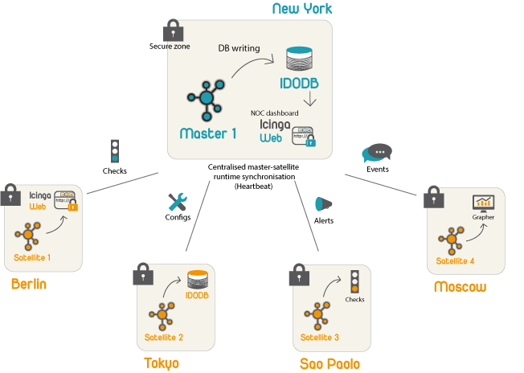
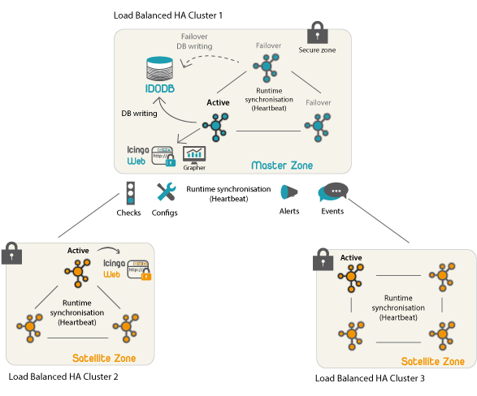

#HSLIDE

## Icinga2 Tutorium
#### Frühjahrsfachgespräch der GUUG 2017

#HSLIDE
## Vorstellungsrunde

#VSLIDE
## Wer bin ich? 

* Senior Consultant credativ GmbH
* Debian/GRML Open Source Entwickler
* über 15 Jahre Erfahrung mit Monitoring
* Scrum Master

#VSLIDE
## Wer sind sie / wer seid ihr? 

* Du / Sie? 
* Tätigkeitsfeld
* Erfahrungen mit Monitoring
* Erfahrungen mit Icinga2
* Erwartungen an das Tutorium

#HSLIDE


#VSLIDE
## Was ist Icinga2

Icinga2 ist ein OpenSource Monitoring System das einfache und komplexe 
Monitoringszenarien abbilden kann. 
<br />
**Icinga2 ist kein Nagios Fork**

#VSLIDE
## Features I

* Clusterfähig
* komplexe Konfigurationssprache
* Remote Agent
* Erweiterbar
* kompatibel zu den Monitoring Plugins
* Trending via
  * Graphite
  * InfluxDB
  * PNP4Nagios
  * OpenTSDB

#VSLIDE
## Features II

* Nativer Windows Support (Agent)
* semantisches Logging via GELF
* Darstellung von Businessprozessen
* ITL

#VSLIDE
## Clustering

* Master/Satellite
* Master/Master (HA)
* Automatische Lastverteilung (Worker)
* Mehrstufige Setups
* Konfigurationssynchronisation
* X509

#VSLIDE
## Master mit Satelliten



#VSLIDE
## HA Master




#HSLIDE
# Grundlagen

#VSLIDE
## Grundrinzip


#VSLIDE
### Hosts

* Zu jedem gemonitorten Objekt gehört ein Hostobjekt
* Die Verfügbarkeit des Hosts ergibt sich durch den Status des `hostalive` checks
* Hosts können den [Status](https://docs.icinga.com/icinga2/latest/doc/module/icinga2/chapter/monitoring-basics#host-states) **UP**, **DOWN** und **UNREACHABLE** haben

#VSLIDE
###Services

* Services werden immer einem Host zugeordnet
* Ihr Status ergibt sich aus dem Ergebniss ihres `check_command`s
* Hosts können den [Status](https://docs.icinga.com/icinga2/latest/doc/module/icinga2/chapter/monitoring-basics#service-states) **OK**, **WARNING**, **CRITICAL** und **UNKNOWN** haben.

#VSLIDE
## Hard und Softstates

Ein Service Check muss eine bestimmte Anzahl (`max_check_attempts`) von Ergebnissen durchlaufen bevor Notifizierungen ausgelöst werden und der **HARD** Status erreicht wird. 

#HSLIDE

## Konfigurationsdateien

#VSLIDE

## Verzeichnisstruktur

+++?gist=26a91af511a2bc7afb16a0816f9a6b39

#VSLIDE

## Host Objekt

+++?gist=3b79570a22fba8fe9e863d756b5724d9

#VSLIDE

## Simple Service

```cpp
apply Service "procs" {
  import "generic-service"

  check_command = "procs"

  assign where host.name == "myhostname"
}
```

####[check_procs](https://docs.icinga.com/icinga2/latest/doc/module/icinga2/chapter/plugin-check-commands#plugin-check-command-processes)

#VSLIDE

## Override Variables in Service

```cpp
apply Service "procs" {
  import "generic-service"

  check_command = "procs"

  vars.procs_argument = "some argument"
  assign where host.name == "myhostname"
}
```

####[Custom Attributed and Macros](https://docs.icinga.com/icinga2/latest/doc/module/icinga2/chapter/monitoring-basics#custom-attributes)

#HSLIDE

## Konfigurationssprache

#VSLIDE

## Kommentare

```cpp
// Kommentar
/*
 * Auch ein Kommentar
*/
# sogar ich bin ein Kommentar
```

#VSLIDE

## [einfache Datentypen](https://docs.icinga.com/icinga2/latest/doc/module/icinga2/chapter/language-reference?highlight-search=array#types)

```cpp
27.3 # floating point number
```
```cpp
2.5m # duration (ms (milliseconds), 
       s (seconds), 
       m (minutes), 
       h (hours) and 
       d (days))
```
```cpp
"Hello World" # string
{{{
  Multi
  Line
  String
}}}
```
```cpp
true / false # boolean
```
```cpp
null
```

#VSLIDE
## Arrays

```cpp
  [ "hello", 42 ]
```

#VSLIDE
## Dictionarys

```cpp
{
  address = "192.168.0.1"
  port = 443
  ssl = true
}
```


#VSLIDE

## Apply Direktive

Die Apply Direktive ist es die Hosts/Services und Notifications zusammenbringt. 
<br/>
Sie ermöglicht es anhand von Ausdrücken Objekte mit Hosts zu verbinden


#HSLIDE

# Check Plugins

#VSLIDE

## Basics

* Icinga2 selbst liefert keine Checks mit
* Alle Checks die mit Nagios kompatibel sind werden auch mit Icinga2 funktionieren
* Viele Checks sind in der [ITL](https://docs.icinga.com/icinga2/latest/doc/module/icinga2/chapter/plugin-check-commands) vordefiniert

#VSLIDE

## Monitoring Plugins

* **Die** Standard Checks für Nagios/Icinga/Icinga2
* [monitoring-plugins.org](https://www.monitoring-plugins.org/)

#VSLIDE

## Icinga Exchange

* [Portal für Checks](https://exchange.icinga.com/)

#HSLIDE

# [Notifications](https://docs.icinga.com/icinga2/latest/doc/module/icinga2/chapter/object-types#objecttype-notification)

#VSLIDE

* Notifications sind Scripte die bei bestimmten Events aufgerufen werden
* Notifications können an einen User und/oder eine Gruppe gebunden werden.
* Jede Notification kann einen Filter haben der bestimmt zu welchen Zeiten sie ausgelöst wird
* Jeder User kann einen Filter haben der bestimmt wann er notifiziert werden will. 
* Über `types` und `states` Filter kann man einstellen bei welchen Events die Notification auslöst.

#VSLIDE

## Notification Beispiel

```cpp
object Notification "localhost-ping-notification" {
  host_name = "localhost"
  service_name = "ping4"

  command = "mail-notification"

  users = [ "user1", "user2" ]

  types = [ Problem, Recovery ]
}
```


#HSLIDE

# Erweiterungen / Integration

#VSLIDE

## [Icinga-web2-director](https://github.com/Icinga/icingaweb2-module-director)

* Icingaweb2 Modul
* *Konfigurationswebfrontend* für Icinga2
* Module für den Import von verschiedenen Quellen:
  * CSV
  * Puppetdb
  * LDAP
  * Dateien
  * AWS
* REST API

#VSLIDE


#VSLIDE

# [Icingaweb2-Business-Process-View] (https://github.com/Icinga/icingaweb2-module-businessprocess)

* Modellierung von Business Views
* *Manager* Kompatibilität
* Simulation von Incidents
* Webbasiserter Editor

#VSLIDE


#VSLIDE

## Slack Integration

* [formorer/icinga2-slack-notification](https://github.com/formorer/icinga2-slack-notification)
* [spjmurray/slack-icinga2](https://github.com/spjmurray/slack-icinga2) (2way)
* [richardhauswald/icinga2-slack-notifications](https://exchange.icinga.com/richardhauswald/icinga2-slack-notifications)

#VSLIDE

## [Icinga2 Dashing](https://github.com/Icinga/dashing-icinga2)

* Sinatra/Dashing basiertes Dashboard
* Benutzt die API

#VSLIDE

